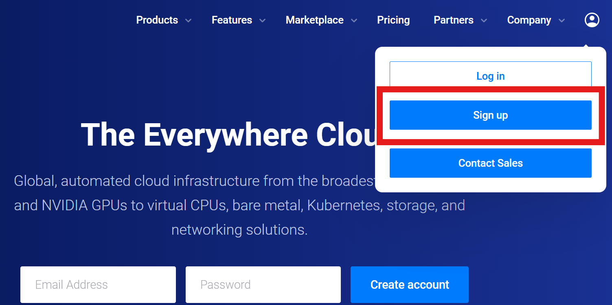
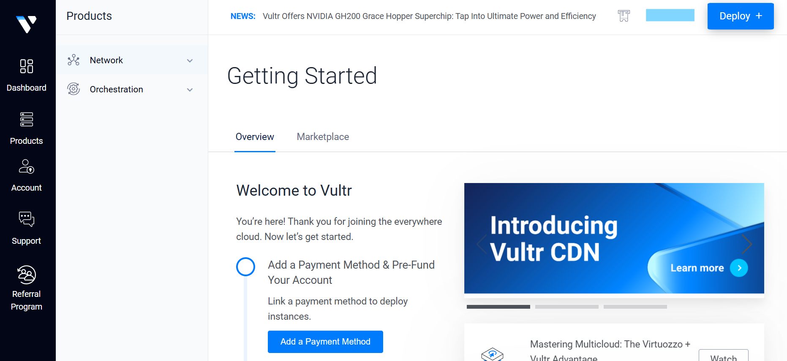
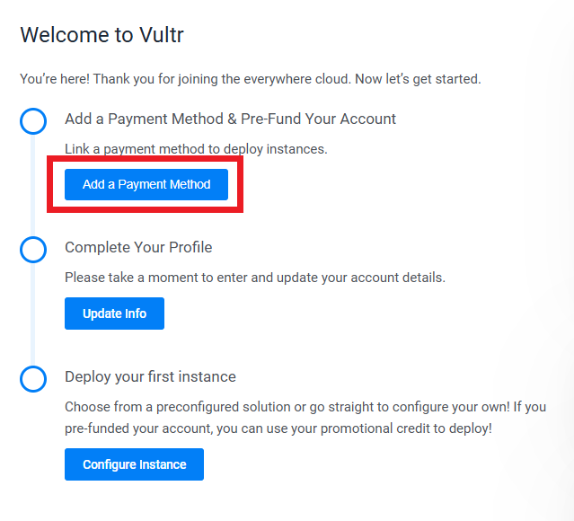
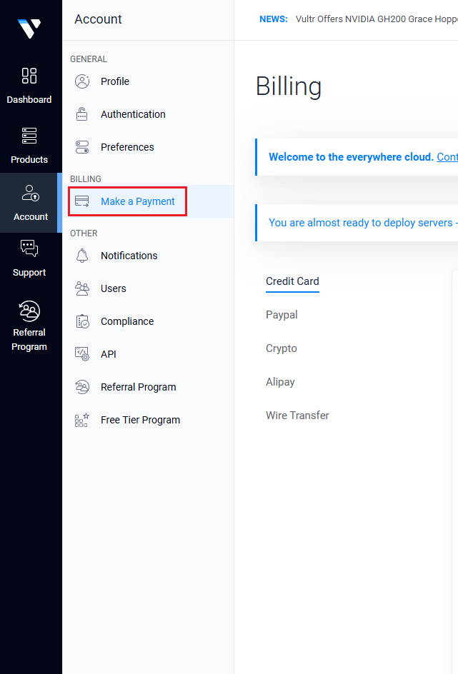
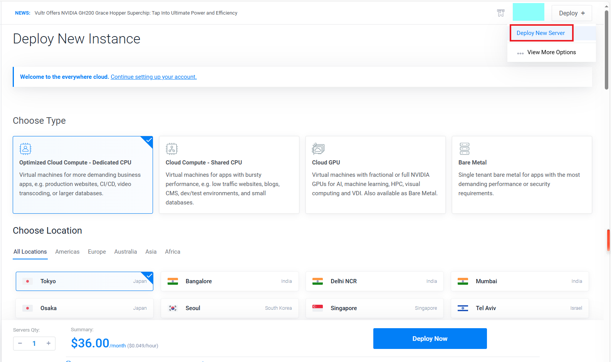
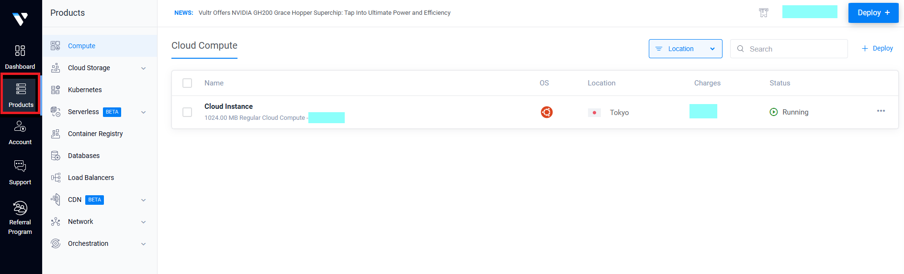
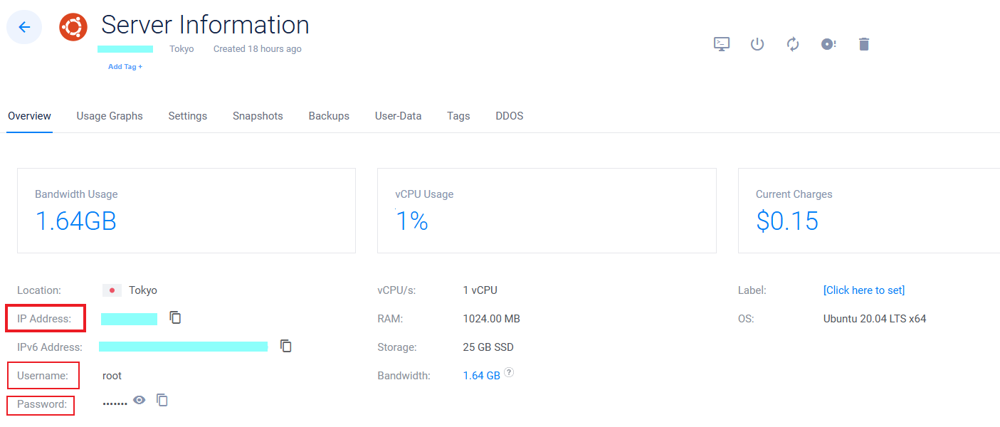
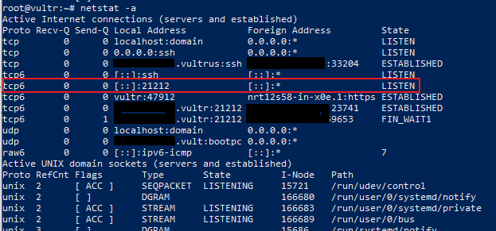

# 简明教程：如何使用vultr平台搭建VPN服务器<br>simple guide on how to use vultr as VPN servers
## Step 1:  打开vultr官网，注册账号<br> open vultr official site and sign up
打开链接 打开vultr官网：[vultr官网链接](https://www.vultr.com/?ref=9674465) <br>
open link vultr official site：[vultr official site](https://www.vultr.com/?ref=9674465) <br>

页面右上角，选择sign up<br>
on the upper right corner of the page, choose 'sign up'<br>
使用邮箱注册，或者选择github/google账号注册，这里以邮箱注册为例，
输入邮箱验证码<br>
use your email address to sign up or github/google accout, we use email as example,
input the authentication code you received
<div style="display: flex;">
    
    
</div>
接下来将会进入到以下页面，即表明注册完成<br>
you will enter the following page, that completes signing up process.



## Step 2:  添加支付方式，预存款<br> add a payment method and pre-fund
在欢迎页面中可以按照提示添加支付方式并进行预存款，支付的最低额度为10美元<br>
in the welcome page you can add a payment method and pre-fund your account，each transaction is 10$ at least<br>
<br>
可以先跳过该步骤，选好目标产品后再根据需要进行支付，支付页面位于：个人主页->Account->选择billing:Make a Payment<br>
you can also skip this step，make payment after selecting products you need，payment page is in：Home->Account->billing:Make a Payment
<br>
## Step 3:  部署并启动服务器<br> deploy and start a new server
在个人主页的右上角选择deploy->deploy new server<br>
on the upper right corner of Home page, select deploy->deploy new server<br>
<br>
进入部署页面后，选择所需的服务器类型，地理位置，系统软件，服务器配置等，这里我的选择是<br>
* 类型: Cloud Compute - Shared CPU
* 地理位置: Tokyo
* 镜像:Ubuntu 20.04 LTS x64
* 计划:Regular Cloud Compute - 25 GB SSD
* 额外特性: IPv6

after entering 'deplay new instance' page, select target server with spefified type, location, system and softwares, configurations, etc. My option is:<br>
* Type: Cloud Compute - Shared CPU
* Location: Tokyo
* Image:Ubuntu 20.04 LTS x64
* Plan:Regular Cloud Compute - 25 GB SSD
* Additional Features: IPv6

点击'deploy now'按钮进行部署，如果账户余额不足，可能需要返回Step 2进行支付，成功部署后，进入products页面即可看到部署的服务器。<br>
click 'deploy now' button to deploy you server. If no credit remains you may go back to Step 2 to fund your account. After successfully deployed, you can go to Home->products to check your server.<br>
<br>

## Step 4:  SSH连接远程服务器<br> remote control the server using SSH
点击部署好的服务器，进入详情页面：可以看到IP地址，用户名和密码。<br>
click into the server，you will get into this page with some important infos including IP addr,username and password<br>
<br>
使用ssh命令连接远程服务器，按照提示输入密码<br>
use ssh to connect to remote server,using ip address and password mentioned above<br>
```
ssh root@ip
```
## Step 5:  安装v2ray服务器<br> install v2ray on server
使用以下两条命令下载v2ray安装脚本并执行:<br>
use following commands to download and execute v2ray installation script:<br>
```
curl -O https://raw.githubusercontent.com/v2fly/fhs-install-v2ray/master/install-release.sh
```
```
sudo bash install-release.sh
```
## Step 6:  配置v2ray服务器<br> configure the server 
config.json文件是v2ray服务器端的配置文件,一般位于/usr/local/etc/v2ray/目录下，可通过以下命令查看<br>
The config.json file is the configuration file of the v2ray server, which is usually located in the /usr/local/etc/v2ray/ directory:<br>
```
cat /usr/local/etc/v2ray/config.json
```
该配置文件一开始可能是空的，接下来我们在本地编辑配置文件，并通过scp命令传输过去。<br>
this config file may be empty in the first place, we now write a config file locally and send it through scp command<br>
在本地新建config.json文件，粘贴以下代码：<br>
create a new file named 'config.json' and paste following code:<br>
```
{
  "log": {
    "access": "/var/log/v2ray/access.log",
    "error": "/var/log/v2ray/error.log",
    "loglevel": "warning"
  },
  "inbound": {
    "port": 21212, 
    "listen": "0.0.0.0",
    "protocol": "vmess",
    "settings": {
      "auth": null,
      "udp": false,
      "ip": null,
      "clients": [
        {
          "id": "d50bb6ea-49a8-4f95-b5be-a275d21a8211", //
          "alterId": 0,
          "security": null
        }
      ]
    }
  },
  "outbounds": [
    {
      "protocol": "freedom",
      "settings": {}
    }
  ]
}
```
上面的配置代码主要含义如下:
* 监听0.0.0.0（任意IP）的21212端口
* VPN协议为Vmess
* 用户id为d50bb6ea-49a8-4f95-b5be-a275d21a8211

The main meanings of the above configuration code are as follows:
* Listen to port 21212 of 0.0.0.0 (any IP)
* VPN protocol is Vmess
* User id is d50bb6ea-49a8-4f95-b5be-a275d21a8211

打开新命令行界面，使用scp命令传输到远端服务器的/usr/local/etc/v2ray/目录<br>
Next, open new cmd promt, use the scp command to transfer to the /usr/local/etc/v2ray/ directory on the remote server/<br>
```
scp path_to/config.json root@ip:/usr/local/etc/v2ray/
```
再次查看配置文件内容：<br>
again check the content of the config.json file, it should be updated<br>
```
cat /usr/local/etc/v2ray/config.json
```
启动v2ray服务：<br>
start v2ray service：<br>
```
sudo systemctl restart v2ray
```
v2ray服务器正常启动后，可以通过netstat命令看到对应的网络端口状态：<br>
After the v2ray server starts normally, you see the corresponding network port status through the command:
```
netstat -a 
```
<br>
有些情况下端口受防火墙保护，需要通过以下命令放行端口:<br>
In some cases, the port is protected by a firewall and you need to open the port using the following command:<br>
```
sudo ufw allow 21212
```
## Step 7:  VPN客户端<br> using the VPN client 
