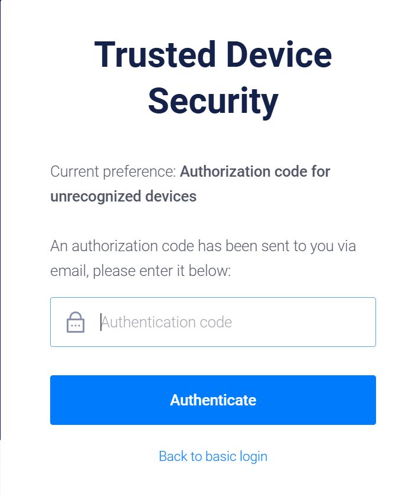

# 简明教程：如何使用vultr平台搭建VPN服务器 simple guide on how to use vultr as VPN servers
## Step 1:  打开vultr官网，注册账号  open vultr official site and sign up
打开链接 打开vultr官网：[vultr官网链接](https://www.vultr.com/?ref=9674465)  
open link vultr official site：[vultr official site](https://www.vultr.com/?ref=9674465)  

页面右上角，选择sign up 
on the upper right coner of the page, choose 'sign up' 
使用邮箱注册，或者选择github/google账号注册，这里以邮箱注册为例，
输入邮箱验证码 
use your email address to sign up or github/google accout, we use email as example,
input the authentication code you received

    
    

接下来将会进入到以下页面，即表明注册完成 
you will enter the following page, that completes signing up process.

## Step 2:  添加支付方式，预存款  add a payment method and pre-fund

## Step 3:  部署并启动服务器  deplay and start a new server

## Step 4:  SSH连接远程服务器  remote control the server using SSH

## Step 5:  安装v2ray服务器  install v2ray on server

## Step 6:  配置v2ray服务器  configure the server 

## Step 7:  VPN客户端  using the VPN client 
